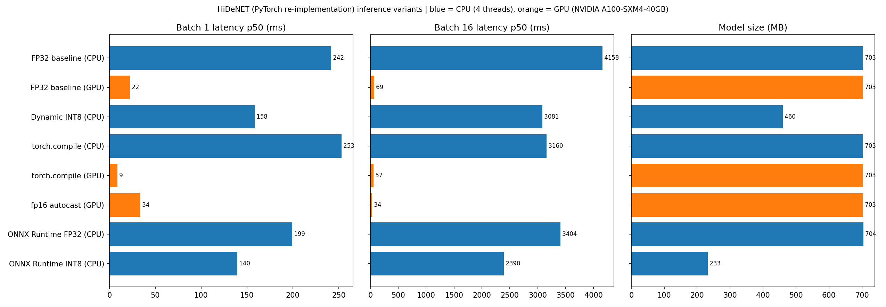
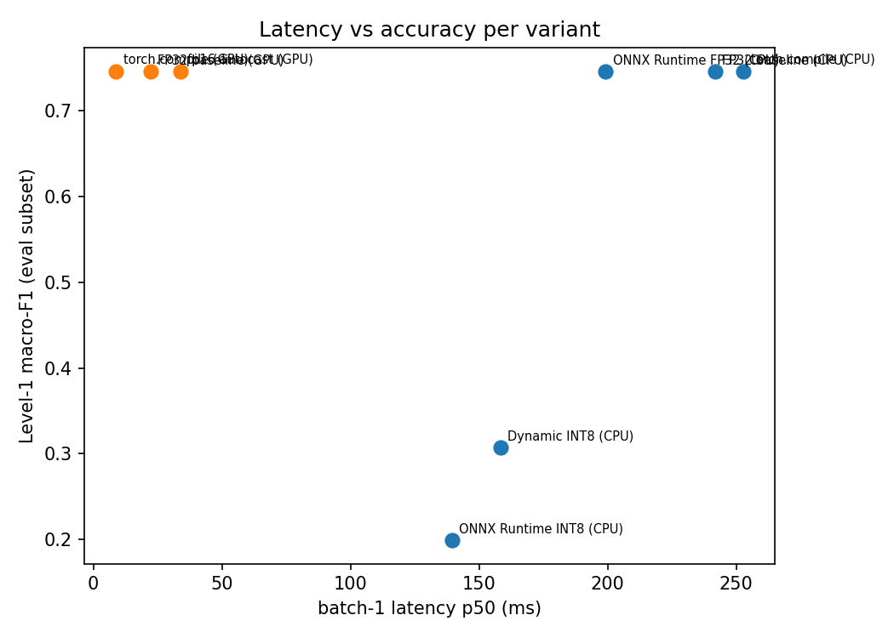

# HiDeNET Inference Optimization

An inference-optimization study of **HiDeNET**, a hybrid DeBERTa-v3 + 1D-CNN model for three-level sentiment classification of cryptocurrency comments (IEEE SCEECS 2026, Best Paper, CSE track).

The original TensorFlow checkpoint was never saved, so this repo contains a **PyTorch re-implementation retrained on the same stratified split**, followed by a measured study of `torch.compile`, mixed precision, ONNX Runtime and INT8 quantization. It does **not** optimize the published weights.

**Headline results** (500 held-out examples, A100 GPU and a 4-thread Xeon CPU):

- `torch.compile` cut A100 batch-1 latency by **60%** (22.3 to 8.8 ms), with 100% prediction agreement against FP32.
- fp16 autocast raised A100 batch-16 throughput by **2.03x** (231 to 468 samples/s), with 100% agreement. It is slower at batch 1.
- ONNX Runtime FP32 cut CPU latency by **17%** at batch 1 and 18% at batch 16, lossless.
- **Dynamic INT8 quantization broke the model** (Level 1 agreement 29 to 42%). Section "What didn't work" documents the diagnosis.

Author: Nitya Dhagat

---

## Re-implementation vs the paper

Retrained once (20 epochs, batch 16, lr 2e-5, focal loss with gamma 2.0 and alpha 0.5 / 0.25 / 0.25, fp16 autocast, DeBERTa-v3-base backbone frozen) and evaluated on the full test split (n = 1853, 20% stratified split of 9263 cleaned rows). The paper reports Hamming loss, so the paper's accuracy below is `1 - Hamming loss`.

| Level | Paper accuracy (1 - Hamming) | This re-implementation accuracy | Paper macro-F1 | This re-implementation macro-F1 |
|---|---|---|---|---|
| 1 | 0.792 | 0.805 | 0.75 | 0.763 |
| 2 | 0.884 | 0.883 | not reported | 0.410 |
| 3 | 0.848 | 0.833 | 0.65 | 0.643 |

The minority classes fail in the same way as in the paper (for example Level 2 class 1 has recall 0.00, and Level 3 class 3 has recall 0.14). Full classification reports are in `results/`. The backbone-frozen setting is an assumption: the original TensorFlow code froze layers through `deberta_model.layers[:6]`, which most likely froze the entire backbone, but I could not verify this. The metrics sit within about 1.5 points of the paper at every level.

---

## Setup

| | |
|---|---|
| GPU | NVIDIA A100-SXM4-40GB (Google Colab) |
| CPU | Intel Xeon @ 2.20 GHz, 12 vCPUs on the VM, 4 threads used |
| Software | Python 3.13.15, torch 2.11.0+cu130, transformers 5.18.0, onnxruntime 1.30.0, onnx 1.23.1 |
| Input | fixed padding to 256 tokens (worst-case shape), real test examples |
| Timing protocol | same inputs for every variant, 10 warmup runs, then GPU 100 timed runs, CPU batch 1 = 100 runs, CPU batch 16 = 20 runs, p50 and p95 |
| CPU re-measurement | all CPU variants re-measured back to back, interleaved over 3 rounds (pooled: 60 runs at batch 1, 18 at batch 16), because the first pass ran on shared hardware |
| Compile time | first call per shape excluded from latency, reported separately |
| Accuracy and agreement | fixed random subset of 500 held-out examples, same for every variant. Agreement is the percentage of identical predictions against the FP32 CPU baseline |

---

## Results

| Variant | Size (MB) | bs1 p50 / p95 (ms) | bs16 p50 / p95 (ms) | bs16 throughput (samples/s) | Accuracy L1 / L2 / L3 | Agreement vs FP32 L1 / L2 / L3 (%) |
|---|---|---|---|---|---|---|
| FP32 CPU (baseline) | 703.4 | 245.4 / 253.9 | 4147 / 4198 | 3.9 | 0.780 / 0.880 / 0.864 | 100 / 100 / 100 |
| `torch.compile` CPU | 703.4 | 249.4 / 257.3 | 3763 / 3825 | 4.3 | 0.780 / 0.880 / 0.864 | 100 / 100 / 100 |
| ONNX Runtime FP32 | 704.2 | 203.9 / 221.4 | 3404 / 3479 | 4.7 | 0.780 / 0.880 / 0.864 | 100 / 100 / 100 |
| Dynamic INT8 (torch) | 459.7 | 165.2 / 169.3 | 3414 / 3463 | 4.7 | 0.396 / 0.872 / 0.660 | 42.0 / 98.6 / 69.6 |
| ONNX Runtime INT8 | 232.6 | 136.3 / 139.6 | 2388 / 2422 | 6.7 | 0.264 / 0.872 / 0.652 | 28.8 / 98.6 / 68.2 |
| ORT INT8, FFN output FP32, per-channel | 596.3 | 162.3 / 172.4 | 2778 / 2807 | 5.8 | 0.736 / 0.870 / 0.842 | 84.4 / 99.0 / 93.8 |
| FP32 GPU (A100, baseline) | 703.4 | 22.3 / 23.9 | 69.4 / 69.6 | 230.5 | 0.780 / 0.880 / 0.864 | 100 / 100 / 100 |
| `torch.compile` GPU | 703.4 | 8.8 / 10.1 | 57.4 / 57.6 | 278.8 | 0.780 / 0.880 / 0.864 | 100 / 100 / 100 |
| fp16 autocast GPU | 703.4 | 33.9 / 36.5 | 34.2 / 34.7 | 468.1 | 0.780 / 0.880 / 0.864 | 100 / 100 / 100 |

Notes on the table:

- Maximum probability differences against the FP32 CPU baseline: ONNX Runtime FP32 about 5e-6, `torch.compile` CPU about 8e-6, GPU FP32 and `torch.compile` GPU about 3e-4, fp16 autocast about 2e-3. Predictions were identical for all of these.
- Compile time (first call, excluded above): about 51 s on CPU and 21 s on GPU at batch 1, and about 31 s (CPU) and 29 s (GPU) at batch 16.
- `torch.compile` on CPU is not stable at batch 16: two measurement passes gave 3160 ms and 3763 ms, so I treat the gain as roughly 10 to 30%. At batch 1 it gives no gain.
- ONNX Runtime FP32 was also checked at a different shape (batch 3, length 128) against PyTorch: maximum probability difference 1.9e-6.

---

## Profiling findings

`torch.profiler` with `record_shapes=True`, FP32 on CPU, 5 iterations after warmup.

| Op | Batch 1 (% of CPU time) | Batch 16 (% of CPU time) |
|---|---|---|
| `aten::addmm` (linear layers) | 60.7 | 41.7 |
| `aten::bmm` (attention matmuls) | 11.1 | 20.1 |
| `aten::gather` | 4.9 | 8.3 |
| `aten::copy_` | 5.0 | 7.8 |
| `aten::add` | 2.9 | 5.9 |
| `aten::div` | 1.3 | 4.9 |
| `aten::_softmax` | 1.3 | 3.7 |
| `aten::gelu` | 1.0 | 3.1 |
| `aten::mkldnn_convolution` (the CNN head) | n/a | 0.2 |

- The backbone accounts for essentially all of the runtime; the Conv1D head is negligible.
- Linear layers dominate, as expected. Batching shifts cost toward attention matmuls and memory-bound ops (`gather`, `copy_`, elementwise add and div).
- The `gather` cost is likely from DeBERTa's relative-position attention (not verified).
- A separate backbone-vs-head timing used fewer iterations and reported lower absolute batch-16 times than the main benchmark, so I rely only on its ratio (backbone about 100% of the total).

---

## What worked

- **`torch.compile` on GPU.** Batch-1 latency falls from 22.3 to 8.8 ms (2.5x). Batch 1 on a fast GPU is dominated by kernel-launch overhead, which compilation and fusion reduce. At batch 16 the work is compute-bound, so the gain is smaller (1.2x).
- **fp16 autocast on GPU.** 2.03x throughput at batch 16, with identical predictions. It is slower at batch 1 (33.9 vs 22.3 ms). A likely cause is per-call weight casts and launch overhead dominating small batches (not verified). Converting weights to fp16 once, or combining autocast with `torch.compile`, would be the next thing to try.
- **ONNX Runtime FP32 on CPU.** 1.20x faster at batch 1 and 1.22x at batch 16 with no accuracy change.

## What didn't work

### Dynamic INT8 quantization breaks this model

Both torch `quantize_dynamic` and ONNX Runtime dynamic quantization collapsed Level 1 agreement to 42% and 29%. Diagnosis, using 192 evaluation samples unless noted (about plus or minus 3 points):

| What was quantized | Level 1 agreement (%) |
|---|---|
| head layers only | 97.9 |
| attention layers only | 94.8 |
| FFN intermediate layers only | 65.6 |
| everything except FFN output layers | 67.7 |
| all FFN layers | 42.7 |
| whole backbone | 39.6 |
| whole backbone, per-channel weights | 52.1 |
| FFN output layers only | 26.0 |
| ORT, MatMul only (embeddings untouched) | 26.0 |
| ORT, MatMul only, per-channel | 63.0 |
| ORT, FFN output FP32, per-channel | 84.4 |

1. The damage is in the backbone, mostly the FFN layers. Quantizing the head or attention alone keeps most predictions.
2. Last-layer hidden states differ from FP32 by about 80% relative error on real tokens and about 134% on padding tokens (16 samples). The CLS cosine similarity still looks high (0.98) while the pooled conv features are lower (0.86). Cosine can hide large errors when a few dimensions dominate, so relative error is the more honest number.
3. Error accumulates over depth rather than coming from one layer. Quantizing just one FFN output layer at a time costs between 2 and 40 agreement points (96 samples, about plus or minus 5 points):

| Layer | 0 | 1 | 2 | 3 | 4 | 5 | 6 | 7 | 8 | 9 | 10 | 11 |
|---|---|---|---|---|---|---|---|---|---|---|---|---|
| Level 1 agreement (%) | 90.6 | 86.5 | 80.2 | 72.9 | 60.4 | 78.1 | 61.5 | 83.3 | 78.1 | 86.5 | 96.9 | 97.9 |

4. Per-channel weight scales did not fix it, so weight granularity is not the problem. My working explanation is activation outliers, which have been reported for BERT-style models; I did not measure activation ranges directly.
5. The default ONNX Runtime INT8 file is much smaller (233 MB) because it also quantizes the embedding table. MatMul-only quantization (515 MB) was still broken, so the embedding table is not the cause.
6. The best mitigation (FFN output layers kept in FP32, per-channel weights in ORT) still changes about 16% of Level 1 predictions and drops Level 1 accuracy by 4.4 points, so it is not a valid optimization.

### Padding sensitivity

Inputs are padded to 256 tokens, but real inputs are short: median 20 real tokens, mean 42, 95th percentile 170. Trimming each input to its real length is much faster, but it is **not lossless** in this model:

| | Per-call p50 (ms) | Agreement vs fixed-length FP32 (L1 / L2 / L3 %) | Level 1 accuracy |
|---|---|---|---|
| fixed 256, batch 1 | 245.4 | 100 / 100 / 100 | 0.780 |
| trimmed, batch 1 | 111.8 | 92.8 / 99.6 / 95.4 | 0.768 |
| fixed 256, batch 16 | 4147 | 100 / 100 / 100 | 0.780 |
| trimmed, batch 16 (to longest in batch) | 2750 | 95.2 / 99.2 / 97.6 | 0.764 |

The cause is the architecture. The Conv1D max-pool sees padded positions, and the model was trained with them included. Masking padded positions in the pool and retraining the head would make length-aware inference safe; I did not do this.

---

## Limitations

- Weights are a PyTorch retrain, not the published checkpoint, and the backbone-frozen setting is an unverified assumption (see above).
- Accuracy and agreement use a fixed 500-example subset. Minority-class F1 at Levels 2 and 3 is noisy at this size, and Level 2 accuracy mostly reflects the majority class.
- All timing is from a single shared Colab VM and varies run to run. Fixed 256-token padding is a worst-case input shape.
- The quantization diagnostics use 96 to 192 samples, so the percentages are approximate.
- One engineering note: transformers 5.x can load the DeBERTa weights in fp16 by default. The notebook forces FP32 weights so the baseline is genuinely FP32.

## What I would try next

Static INT8 quantization with calibration data, SmoothQuant-style activation smoothing, quantization-aware training, masked pooling plus length bucketing, fp16 together with `torch.compile` on GPU, TensorRT, and distilling to a smaller encoder.

---

## Reproduce

1. Open `hidenet_inference_optimization.ipynb` in Google Colab with a GPU runtime (the numbers above are from an A100).
2. Put the cleaned dataset at `Research/crypto-fire-analysis/train_data/cleaned_dataframe.csv` on Google Drive (columns `Text`, `label_level_1`, `label_level_2`, `label_level_3`), or change the paths in the config cell.
3. Run the cells in order. Training (Part A) takes about 5 minutes on an A100. Parts B and C take roughly an hour or more on the Colab CPU, and finished steps are cached on Drive so a disconnect can be resumed.

The dataset (CryptoQA 2024, FIRE) is not redistributed here, and model checkpoints and ONNX files are not committed.

## Repo contents

- `hidenet_inference_optimization.ipynb`: the full notebook (retraining, benchmarks, profiling, diagnostics) with outputs.
- `results/`: raw numbers (`results.json`, `results_table.csv`), profiler tables, charts, re-implementation metrics and classification reports, environment and quantization diagnosis files.
- `requirements.txt`: library versions used.
